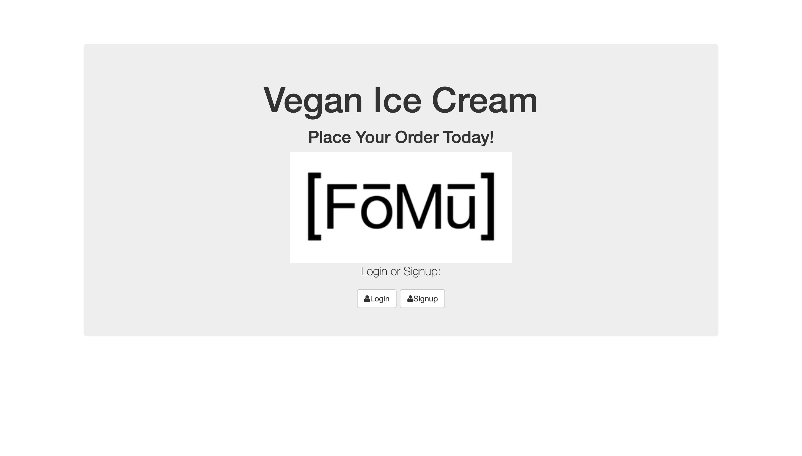

# FOMU-fullstackApp-userLogIn

# FOMU CRUD Full-stack User Login

## Installation

1. Clone repo
2. run `npm install`

## Usage

1. run `npm init`
2. run  `node server.js`
3. Navigate to `localhost:8080`
